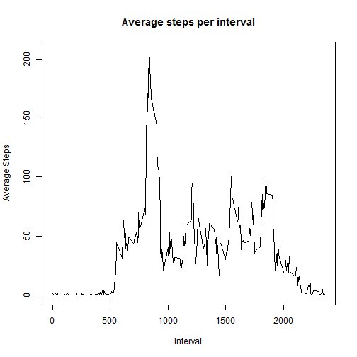

```r
library(plyr)
library(ggplot2)

d = as.data.frame(read.csv("activity.csv"))
d[,"date"] = as.Date(d[,"date"])
summary(d)
```

```
##      steps            date               interval   
##  Min.   :  0.0   Min.   :2012-10-01   Min.   :   0  
##  1st Qu.:  0.0   1st Qu.:2012-10-16   1st Qu.: 589  
##  Median :  0.0   Median :2012-10-31   Median :1178  
##  Mean   : 37.4   Mean   :2012-10-31   Mean   :1178  
##  3rd Qu.: 12.0   3rd Qu.:2012-11-15   3rd Qu.:1766  
##  Max.   :806.0   Max.   :2012-11-30   Max.   :2355  
##  NA's   :2304
```

##Steps per day


```r
days = dlply(d, "date", function(x) {
  sum(x[,"steps"], na.rm=T)
  })
hist(unlist(days), xlab="Number of steps", breaks = seq(0, 25000, 500))
abline(v = mean(unlist(days)), col="red")
abline(v = median(unlist(days)), col="green")
legend("topright", c("mean","median"), col=c("red", "green"), lty=c(1,1))
```

 

```r
mean(unlist(days))
```

```
## [1] 9354
```

```r
median(unlist(days))
```

```
## [1] 10395
```

##Steps vs Interval

```r
intervals = dlply(d, "interval", function(x) {
  mean(x[,"steps"], na.rm=T)
  })

plot(names(intervals),unlist(intervals),type="l", xlab="Interval", ylab="Average Steps", main="Average steps per interval")
```

 

```r
names(intervals[max(unlist(intervals))])
```

```
## [1] "1705"
```

##Missing Data

```r
sum(is.na(d[,"steps"]))
```

```
## [1] 2304
```

```r
d2 = ddply(d, "interval", function(x) {
  x[is.na(x[,"steps"]),"steps"] = mean(x[,"steps"], na.rm=T)
  x
  })
```

##Steps per day with fixed data


```r
days = dlply(d2, "date", function(x) {
  sum(x[,"steps"], na.rm=T)
  })
hist(unlist(days), xlab="Number of steps", breaks = seq(0, 25000, 500))
abline(v = mean(unlist(days)), col="red")
abline(v = median(unlist(days)), col="green")
legend("topright", c("mean","median"), col=c("red", "green"), lty=c(1,1))
```

 

```r
mean(unlist(days))
```

```
## [1] 10766
```

```r
median(unlist(days))
```

```
## [1] 10766
```

The substitution of average steps per interval for the missing data resulted in the agreement of the mean and the median. The mean and median average steps per day increase.


```r
weekday = !(weekdays(d2[,"date"]) %in% c("Saturday","Sunday"))
d2 = cbind(d2, weekday = factor(weekday, levels=c(T, F), labels=c("weekday", "weekend")))

ggplot(subset(d2, weekday=weekday), aes(x=interval, y=steps)) + 
  stat_summary(fun.y=mean,geom="line") + 
  facet_grid(weekday ~ .)
```

 
